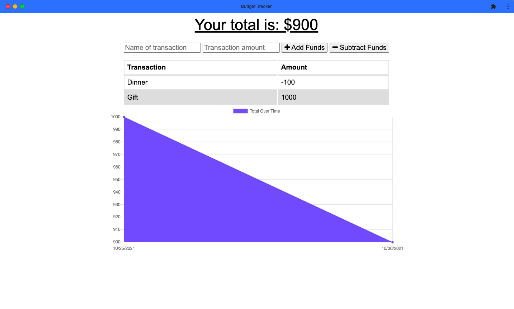

# Progressive Web Application - Budget Tracker

## Description
This budget tracker application allows for offline access and functionality. The user will be able to add expenses and deposits to their budget with or without a connection. If the user enters transactions offline, the total should be updated when they're brought back online.

GIVEN a budget tracker without an internet connection
WHEN the user inputs an expense or deposit
THEN they will receive a notification that they have added an expense or deposit
WHEN the user reestablishes an internet connection
THEN the deposits or expenses added while they were offline are added to their transaction history and their totals are updated

## Built With
* Node.js
* IndexedDB
* Service Workers
* MongoDB
* PWA (Web Manifest)

## Deployed on Heroku
<https://limitless-ravine-16914.herokuapp.com>

## Contribution
< > with ❤️  by Serena Guo

## Screenshots

